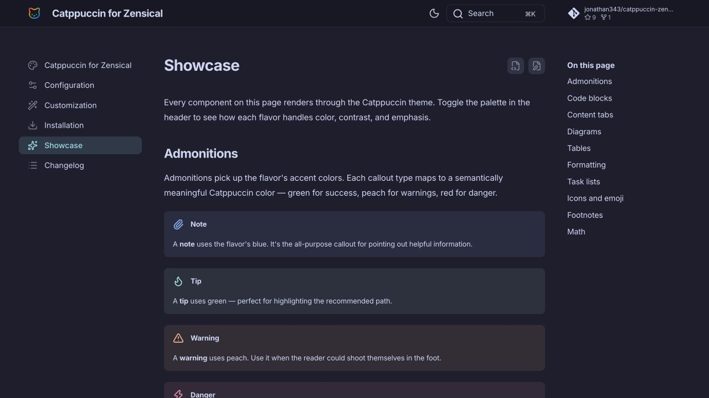
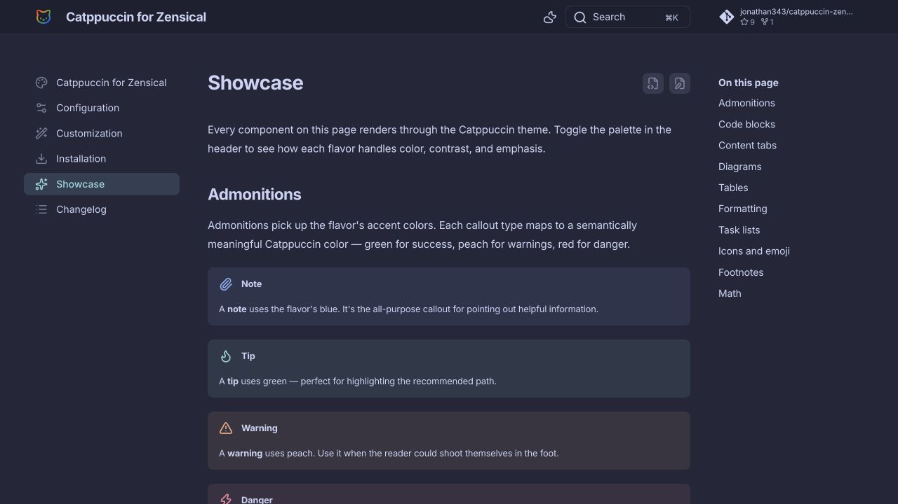
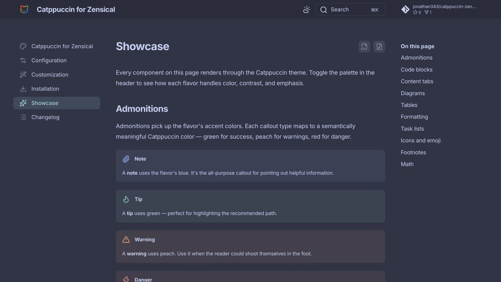
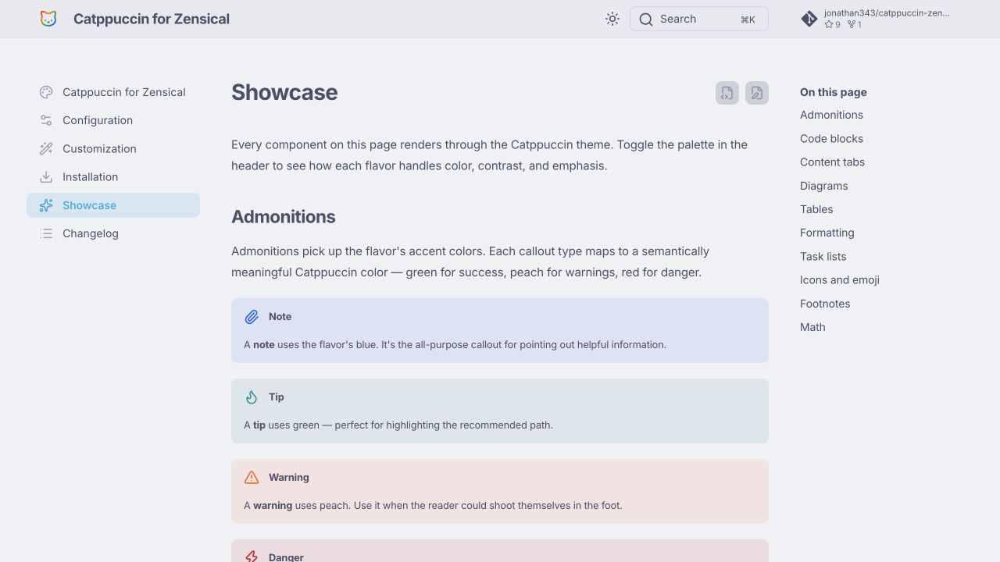

# Catppuccin Zensical

[](https://pypi.org/project/catppuccin-zensical/)
[](https://pypi.org/project/catppuccin-zensical/)
[](https://jonathan343.github.io/catppuccin-zensical/)
[](LICENSE)

A [Catppuccin](https://catppuccin.com/) theme extension for
[Zensical](https://zensical.org/) and MkDocs sites.

It registers an installable theme named `catppuccin` that extends Zensical's
Material-compatible theme with Catppuccin's Latte, Frappé, Macchiato, and Mocha
palettes.

[Live demo](https://jonathan343.github.io/catppuccin-zensical/) ·
[Showcase](https://jonathan343.github.io/catppuccin-zensical/showcase/) ·
[Configuration](https://jonathan343.github.io/catppuccin-zensical/configuration/) ·
[Changelog](https://jonathan343.github.io/catppuccin-zensical/changelog/)

### Mocha



### Macchiato



### Frappé



### Latte



## What you get

- Four Catppuccin flavors: Latte, Frappé, Macchiato, and Mocha.
- Automatic light/dark mode defaults: Latte for light mode and Mocha for dark
  mode.
- Catppuccin colors across Zensical components, including navigation, search,
  code blocks, admonitions, tables, highlights, diagrams, and footer elements.
- A small optional "Styled with catppuccin-zensical" footer signature that links
  back to the live documentation.

## Quick start

Install the package in the same environment as Zensical:

```sh
uv pip install catppuccin-zensical
```

Then set the theme name in `zensical.toml`:

```toml
[project.theme]
name = "catppuccin"
```

Or in `mkdocs.yml`:

```yaml
theme:
  name: catppuccin
```

## Choose a flavor

The default configuration follows the user's system preference with Latte for
light mode and Mocha for dark mode. To force a specific flavor, set the palette
scheme:

```yaml
theme:
  name: catppuccin
  palette:
    scheme: catppuccin-macchiato
    primary: custom
    accent: custom
```

Available schemes:

| Flavor | Scheme |
| --- | --- |
| Latte | `catppuccin-latte` |
| Frappé | `catppuccin-frappe` |
| Macchiato | `catppuccin-macchiato` |
| Mocha | `catppuccin-mocha` |

## Footer signature

The theme adds a small "Styled with catppuccin-zensical" line to the footer that
links to the live documentation. To opt out, set:

```toml
[project.extra.catppuccin]
signature = false
```

Or in `mkdocs.yml`:

```yaml
extra:
  catppuccin:
    signature: false
```

## Local development

From this checkout:

```sh
uv sync --all-groups
uv run zensical serve
```
